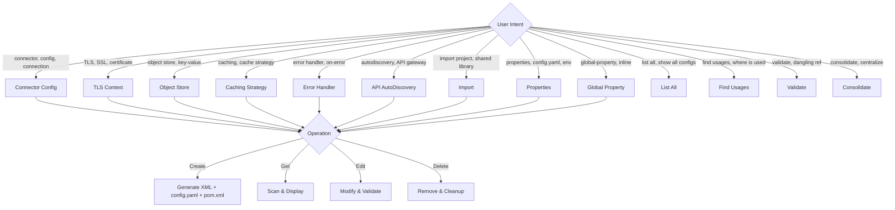

# Manage Global Configurations

## Overview

Create, view, edit, delete, list, validate, and consolidate all global configurations in a Mule 4 project through an interactive, multi-turn workflow.

**What you'll build:** Fully configured global elements in `global-configs.xml`, properties files, and validated pom.xml dependencies — all following MuleSoft best practices.

### Architecture



## Prerequisites

Before starting, ensure you have:

1. **A Mule 4 project** in the workspace with standard structure (`src/main/mule/`, `src/main/resources/`, `pom.xml`)
2. **Anypoint CLI v4** installed with the DX Mule plugin (`@mulesoft/anypoint-cli-dx-mule-plugin`)
3. **Java 11+** and Maven available for build validation
4. **Mule Runtime** available for `dx mule describe-connector` metadata commands

## Execution Paths

- **Create connector config**: Steps 1, 2, 3, 4, 5, 6, 7, 8, 9, 10, 11
  - When: User asks to add a new connector configuration (Salesforce, HTTP, DB, etc.)
  - You'll need: `projectDir`, `connectorName`

- **Create global element**: Steps 1, 2, 12
  - When: User asks to add TLS Context, Object Store, Caching Strategy, Error Handler, AutoDiscovery, or Import
  - You'll need: `projectDir`, `elementType`

- **Manage properties**: Steps 1, 2, 13
  - When: User asks to create/edit properties files, set up environments, or manage global-property elements
  - You'll need: `projectDir`

- **Management operations**: Steps 1, 2, 14
  - When: User asks to list all, find usages, validate, or consolidate global elements
  - You'll need: `projectDir`

## Step 1: Rules and References

**Rules:**

- **Multi-turn interactive.** At every "STOP" marker: print only questions as plain text, end your response, and wait. No tools until all questions in that phase are answered.
- **Pre-supplied value extraction (skip-if-provided).** Before the first STOP, parse the user's initial request and extract any values they already supplied (e.g., connector name, config name, provider name, field values, placeholder preference). Record these as "pre-supplied." At each subsequent STOP point, check whether the question is already answered by a pre-supplied value — if yes, use that value and skip the STOP entirely. Only ask questions for information NOT provided. If the user says "default placeholders" or "use placeholders for all fields," treat that as the answer to Step 8 and skip its STOP. If ambiguity remains (e.g., user says "basic provider" but metadata lists "basic-connection" and "basic-auth"), still ask.
- **No MCP server tools.** ALL Exchange searches and connector operations MUST use ONLY the bash scripts. Never call `search_asset`, `get_asset`, or any MCP-based tool.
- **Never output raw XML to chat** — always write to file.
- **Never use TaskCreate.**
- **Configuration structure from metadata only.** Never hardcode attributes, child elements, or provider names for connectors. The `describe-connector` metadata is the source of truth.
- **Connector versions from Exchange only.** Never paste a version from memory. The only acceptable source is `get_latest_connector.sh` → `pick_connector.sh`.
- **All configs go in `global-configs.xml`.** See `references/global-config-conventions.md` for ordering and structure.
- **pom.xml dependency is MANDATORY.** Every global element that requires a dependency (connectors, Object Store, API AutoDiscovery, imports) MUST have its dependency added to `pom.xml`. Read `pom.xml`, add the `<dependency>` block inside `<dependencies>`, and write the file. The build will fail without this. Never skip this step.

**Scripts:**

This skill includes shell scripts in its own `scripts/` directory. Invoke them with the `Bash` tool at the absolute path you were given in the "skill is now active" message. Do **not** use relative paths.

| Script | Purpose |
| --- | --- |
| `get_latest_connector.sh <search> [nickname]` | Search Exchange for connector candidates (one GAV per line) |
| `pick_connector.sh <nickname> <gav>` | Record chosen GAV as a draft |
| `describe_connector.sh <nickname>` | Run `dx mule describe-connector`, save JSON, echo digest |
| `build_gav.sh <json>` | Turn a saved connector JSON into `groupId:assetId:version` |

Scripts path: `<skill-root>/scripts/` (where `<skill-root>` is the directory containing this SKILL.md).

**References:**

Read these files with the `Read` tool when instructed. Use the absolute path from the "skill is now active" message.

| File | Content | When to Read |
| --- | --- | --- |
| `references/global-elements-catalog.md` | XML templates, namespace URIs, XSD URLs, pom.xml dependencies, attribute tables, validation rules, and connector config generation rules for ALL element types. | Before generating ANY XML — verify structure, required attributes, namespace, and dependency. |
| `references/global-config-conventions.md` | Element ordering, namespace management, centralization rules, default project structure, consolidation decision matrix. | When placing elements in `global-configs.xml`, managing namespaces, or running consolidation. |
| `references/properties-patterns.md` | Property file formats, `${placeholder}` resolution, multi-env patterns, secure properties, built-in properties, naming conventions, validation rules. | When creating/editing properties files, setting up environments, or validating placeholders. |

## Step 2: Resolve Target Project and Route Operation

**Resolve Target Project:**

Run once per session — reuse the result for all subsequent operations in this conversation.

If multiple Mule projects exist in the workspace, ask the user which one to use via `AskUserQuestion` and **STOP**. Do not combine this question with any other question. If only one exists, use it without asking.

**Operation Routing — Level 1 (Domain):**

| Keywords | Domain |
|----------|--------|
| connector, config, connection, Salesforce, HTTP, DB, database, Slack, S3, ServiceNow, Jira, NetSuite, oauth, credentials | → **CONNECTOR CONFIG** |
| TLS, SSL, trust store, key store, certificate, mTLS | → **TLS CONTEXT** |
| object store, key-value store, persistent store, os:config | → **OBJECT STORE** |
| caching, cache strategy, cache scope | → **CACHING STRATEGY** |
| error handler, global error, default error handler, on-error | → **ERROR HANDLER** |
| autodiscovery, API gateway, API ID, API Manager | → **API AUTODISCOVERY** |
| import project, reference project, shared library, JAR import | → **IMPORT** |
| properties, config.yaml, .properties, placeholder, environment, dev/QA/prod, multi-env, check placeholders, unresolved properties | → **PROPERTIES** |
| global-property, inline property, name-value | → **GLOBAL PROPERTY** |
| list all, what global elements, show all configs | → **LIST ALL** |
| find usages, where is used, which flows reference | → **FIND USAGES** |
| validate, check config exists, dangling reference | → **VALIDATE** |
| consolidate, centralize, move to global-config | → **CONSOLIDATE** |

**Operation Routing — Level 2 (Operation):**

| Intent | Operation |
|--------|-----------|
| Create / add / set up / configure (new) | → **CREATE** |
| Get / list / show / view | → **GET** |
| Edit / update / modify / change | → **EDIT** |
| Delete / remove / drop | → **DELETE** |

If unclear, ask:

> What would you like to do? (create, view, edit, delete, validate, consolidate)

**STOP.**

## Step 3: Resolve Connector (CONNECTOR CONFIG — CREATE)

If not specified, ask which connector. Then search Exchange:

```bash
bash scripts/get_latest_connector.sh salesforce sfdc
```

If multiple variants are returned and the user did NOT pre-supply a specific connector artifact, ask user via `AskUserQuestion` and **STOP**. If only one result matches (or the connector is already in `pom.xml`), proceed without asking.

Then pick:

```bash
bash scripts/pick_connector.sh sfdc com.mulesoft.connectors:mule-salesforce-connector:11.1.0
```

If connector is already in the project's `pom.xml`, extract GAV from there instead.

## Step 4: Describe Connector

```bash
bash scripts/describe_connector.sh sfdc
```

Read the `configs[]` and `connectionProviders` from the digest.

## Step 5: Ask Config Name

If the user pre-supplied a config name, use it and skip this STOP. Otherwise ask:

> What name for this connector configuration? (e.g., `salesforceConfig`)

**STOP** (only if not pre-supplied).

## Step 6: Select Connection Provider

If the user pre-supplied a provider name that unambiguously matches one provider from the metadata, use it and skip this STOP. If multiple providers exist and the user did NOT specify one (or the name is ambiguous), ask user.

**STOP** (only if prompting).

## Step 7: Get Provider Detail

```bash
anypoint-cli-v4 dx mule describe-connector \
  --connector "$(bash scripts/build_gav.sh tmp/connector-choices/sfdc.json)" \
  --type connection-provider \
  --name basic-connection \
  --config-name sfdc-config \
  --output json > tmp/connector-metadata/sfdc-config.json
```

Check for `oauthCallbackConfig` child element.

## Step 8: Ask Field Values

If the user pre-supplied explicit field values or indicated "use placeholders" / "default placeholders" for all fields, use that preference and skip this STOP. When placeholders are chosen, generate `${connectorNamespace.fieldName}` for each required field automatically.

Otherwise ask:

> Provide values for required fields, or choose "placeholders" for `${property}` references.

**STOP** (only if not pre-supplied).

## Step 9: Generate XML

Read `references/global-elements-catalog.md` → "Connector Config Generation Rules" section. Generate XML following Pattern 1 (attributes) or Pattern 2 (child elements) based on metadata.

## Step 10: Generate config.yaml

Only for fields where user chose placeholders. Use `${namespace.attributeName}` pattern.

## Step 11: Apply to Project and Validate

1. Write config to `src/main/mule/global-configs.xml` (create if missing — see `references/global-config-conventions.md`).
2. Add namespace + schemaLocation.
3. Write/update `src/main/resources/config.yaml`.
4. **Add connector dependency to pom.xml** (MANDATORY — do not skip):
   - Read the project's `pom.xml`.
   - Check if the connector's `<artifactId>` already exists in `<dependencies>`.
   - If NOT present, add this dependency block inside `<dependencies>`:
     ```xml
     <dependency>
         <groupId>{groupId}</groupId>
         <artifactId>{artifactId}</artifactId>
         <version>{version}</version>
         <classifier>mule-plugin</classifier>
     </dependency>
     ```
   - The `groupId`, `artifactId`, and `version` come from the GAV saved by `pick_connector.sh` in `tmp/connector-choices/`.
   - Write the updated `pom.xml` with the new dependency added.
5. Validate:

```bash
cd <project-dir> && mvn clean package -DskipTests
```

Fix and re-run until `BUILD SUCCESS`.

**GET / EDIT / DELETE (Connector Config):**

**GET:** Scan `src/main/mule/*.xml` for `<*:*-config>` elements with connection provider children. Display name, type, file, provider, attributes.

**EDIT:** GET → ask which → show current values → ask for changes → **STOP** → apply edits → validate.

**DELETE:** Identify → search all XML for `config-ref="{name}"` → show usages → confirm → **STOP** → remove element → clean namespaces → validate.

## Step 12: Create Global Element (TLS, Object Store, Caching, Error Handler, AutoDiscovery, Import)

For all element types below, read `references/global-elements-catalog.md` for the canonical XML structure, required attributes, and validation rules before generating XML.

### TLS CONTEXT — CREATE

**Q1:** Name? Trust Store only / Key Store only / both (mutual TLS)?

**STOP.**

**Q2:** Store paths, passwords (use placeholders). Optional: protocols, cipher suites, revocation check, store type/algorithm.

**STOP.** → Execute: write XML to `global-configs.xml`, add `tls` namespace, update config.yaml.

### OBJECT STORE — CREATE

**Q1:** Need a new `os:config`, or use existing? Name?

**STOP.**

**Q2:** Object Store name, config-ref, persistent?, maxEntries, entryTtl, TTL unit.

**STOP.** → Execute:
1. Write XML (config BEFORE object-store) to `global-configs.xml`.
2. Add `os` namespace: `xmlns:os="http://www.mulesoft.org/schema/mule/os"` and its schemaLocation entry.
3. **Add `mule-objectstore-connector` dependency to pom.xml** (MANDATORY — do not skip):
   - Read `pom.xml` and check if `mule-objectstore-connector` already exists in `<dependencies>`.
   - If NOT present, add this dependency block inside `<dependencies>`:
     ```xml
     <dependency>
         <groupId>org.mule.connectors</groupId>
         <artifactId>mule-objectstore-connector</artifactId>
         <version>1.2.5</version>
         <classifier>mule-plugin</classifier>
     </dependency>
     ```
   - Write the updated `pom.xml`.
4. Validate build: `cd <project-dir> && mvn clean package -DskipTests`.

### CACHING STRATEGY — CREATE

**Q1:** Name? Which Object Store to use (existing reference or inline)?

**STOP.**

**Q2:** Key generation expression? Event copy strategy (simple/serializable)? Synchronized?

**STOP.** → Execute: write XML, add `ee` namespace, ensure Object Store dependency if inline.

### ERROR HANDLER — CREATE

**Q1:** Name? What strategies? (on-error-continue / on-error-propagate). Which error types per strategy?

**STOP.**

**Q2:** What should each strategy do? (log, set payload, set status code). Set as default?

**STOP.** → Execute: write XML + `<configuration defaultErrorHandler-ref="..."/>` if default. Add `ee` namespace if using `<ee:transform>`.

### API AUTODISCOVERY — CREATE

**Q1:** API ID? Which flow? (show available flows from project scan).

**STOP.**

**Q2:** Optional settings (ignoreBasePath, etc.).

**STOP.** → Execute:
1. Write XML to `global-configs.xml`:
   ```xml
   <api-gateway:autodiscovery apiId="${api.id}" flowRef="{flow-name}" doc:name="API AutoDiscovery" />
   ```
2. Add `api-gateway` namespace: `xmlns:api-gateway="http://www.mulesoft.org/schema/mule/api-gateway"` and its schemaLocation entry.
3. **Add `mule-api-gateway` dependency to pom.xml** (MANDATORY — do not skip):
   - Read `pom.xml` and check if `mule-api-gateway` already exists in `<dependencies>`.
   - If NOT present, add this dependency block inside `<dependencies>`:
     ```xml
     <dependency>
         <groupId>org.mule.modules</groupId>
         <artifactId>mule-api-gateway</artifactId>
         <version>${app.runtime}</version>
         <classifier>mule-plugin</classifier>
         <scope>provided</scope>
     </dependency>
     ```
   - Write the updated `pom.xml`.
4. **Add `api.id` to config.yaml** (MANDATORY — do not skip):
   - Read `src/main/resources/config.yaml`.
   - Add `api.id: "YOUR_API_ID"` (or user-specified value) under an appropriate section.
   - Write the updated config.yaml.
5. Validate build: `cd <project-dir> && mvn clean package -DskipTests`.

### IMPORT — CREATE

**Q1:** Maven coordinates (groupId, artifactId, version)?

**STOP.**

**Q2:** What resources to use? Add `<import>` declaration?

**STOP.** → Execute: add dependency to pom.xml, add `<import file="{artifactId}.xml"/>` to global-configs.xml.

### GET / EDIT / DELETE (all element types)

Same shared pattern as Connector Config:

**GET:** Scan all Mule XML for the relevant element patterns. Display grouped by type.

**EDIT:** List → ask which → show values → ask changes → **STOP** → apply → validate.

**DELETE:** Identify → find usages (per-type reference patterns from `references/global-elements-catalog.md`) → present → confirm → **STOP** → remove → namespace cleanup → validate.

## Step 13: Properties Management

Read `references/properties-patterns.md` before any properties operation.

### CREATE FILE

**Q1:** YAML or Properties format? Filename?

**STOP.**

**Q2:** Initial key-value pairs (or "empty")? Register as `<configuration-properties>`?

**STOP.** → Execute: create file in `src/main/resources/`, register in `global-configs.xml` if requested.

### EDIT FILE

**Q1:** List available files → which to edit?

**STOP.**

**Q2:** Show current contents → what to add/modify/remove?

**STOP.** → Execute: apply changes, warn if removed keys are still referenced.

### SETUP ENV

**Q1:** Which environments? (dev, QA, prod, etc.) Default environment?

**STOP.**

**Q2:** What properties differ per environment? Common properties in base `config.yaml`?

**STOP.** → Execute: create per-env files, add `<global-property name="env" value="{default}"/>`, add `<configuration-properties file="${env}.yaml"/>` to global-configs.xml.

### REGISTER / UNREGISTER

**Register:** List unregistered files → ask which → add `<configuration-properties file="..." doc:name="..."/>`.

**Unregister:** List registered files → ask which → warn ("placeholders won't resolve") → confirm → **STOP** → remove element (keep file).

### GLOBAL PROPERTY — CREATE / EDIT / DELETE

**Create Q1:** What name-value pairs?

**STOP.** → Execute: add `<global-property name="..." value="..." doc:name="..."/>` to global-configs.xml.

**Edit:** List → ask which → show → ask new value → **STOP** → apply.

**Delete:** List → find `${name}` usages → present → confirm → **STOP** → remove.

### GET (View Properties Setup)

List: registered files + unregistered files + global properties. Show key counts and registration locations.

## Step 14: Management Operations (List All, Find Usages, Validate, Consolidate)

### LIST ALL

1. Scan all Mule XML files under `src/main/mule/`.
2. Identify every top-level element inside `<mule>` that is NOT `<flow>` or `<sub-flow>`.
3. Categorize: Connector Configs, Configuration Properties, Global Properties, Global Error Handlers, API AutoDiscovery, TLS Context, Object Store, Caching Strategy, Import References, Application Configuration, Other.
4. Count usages per named element (search `config-ref`, `tlsContext`, `objectStore`, `cachingStrategy-ref`, `defaultErrorHandler-ref`, `errorHandler-ref`, `listenerConfig`).
5. Present grouped table with name, type, file, usage count.
6. Highlight issues: unresolved placeholders, scattered configs (not in `global-configs.xml`), unused elements (0 references).

### FIND USAGES

1. Identify target element (list all if not specified, ask which).
2. Search ALL Mule XML files for references using per-type patterns:
   - `config-ref="{name}"` — connector operations/sources
   - `listenerConfig="{name}"` — OAuth callback configs
   - `tlsContext="{name}"` — HTTP configs
   - `objectStore="{name}"` — caching strategies
   - `cachingStrategy-ref="{name}"` — `<ee:cache>` scopes
   - `defaultErrorHandler-ref="{name}"` — `<configuration>`
   - `errorHandler-ref="{name}"` — individual flows
3. Present: file, line, flow/element, attribute, context snippet.

### VALIDATE

Checks that every `config-ref`, `tlsContext`, `objectStore`, `cachingStrategy-ref`, `defaultErrorHandler-ref`, `errorHandler-ref`, and `listenerConfig` attribute in flow XML points to a global element that actually exists in the project.

1. Scan all Mule XML under `src/main/mule/` for reference attributes (`config-ref="X"`, `tlsContext="X"`, `objectStore="X"`, `cachingStrategy-ref="X"`, `defaultErrorHandler-ref="X"`, `errorHandler-ref="X"`, `listenerConfig="X"`).
2. Collect all declared global element names (top-level elements with a `name` attribute).
3. For each reference: check if the referenced name exists in the declared set.
4. Report any **dangling references** — attributes pointing to a global element that does not exist in the project. Include file, line, and the missing name.
5. Suggest fix: create the missing global element, or correct the reference to an existing one.

### CONSOLIDATE

Read `references/global-config-conventions.md` → "Consolidation Decision Matrix" section.

1. Scan all files for global elements outside `global-configs.xml`.
2. Classify each as **movable** or **flow-coupled** (per decision matrix).
3. Present report: what to move, what to keep, with reasons.
4. **Wait for explicit confirmation** → **STOP.**
5. Execute: move elements, add namespace declarations, remove from source, clean unused namespaces.
6. Validate build: `mvn clean package -DskipTests`.
7. Report: moved count, namespace cleanup, build result.

## Tips and Best Practices

- **Configuration structure from metadata only.** Never hardcode attributes or child elements for connectors. The `describe-connector` metadata is the source of truth.
- **Connector versions from Exchange only.** Never paste a version from memory — use `get_latest_connector.sh` → `pick_connector.sh`.
- **All configs go in `global-configs.xml`.** See `references/global-config-conventions.md` for ordering and structure.
- **Multi-turn interactive.** At every decision point: print only questions as plain text, end the response, and wait for user input before proceeding.
- **Skip-if-provided.** When the user's initial request includes details (config name, provider, placeholder preference, field values), skip the corresponding STOP points. Only ask for information that was NOT provided or is ambiguous.
- **Never output raw XML to chat** — always write to file.
- **No MCP server tools.** ALL Exchange searches and connector operations MUST use ONLY the bash scripts provided.
- **Always update pom.xml.** Every connector/module that needs a dependency MUST be added to `pom.xml`. This is the #1 cause of build failures. The dependency XML patterns are documented in `references/global-elements-catalog.md`. Read pom.xml → add dependency → write pom.xml. Do this BEFORE running `mvn clean package`.
- **Always update config.yaml for placeholders.** When using `${property.name}` placeholders in XML, the corresponding property MUST be added to `src/main/resources/config.yaml`. For AutoDiscovery, always add `api.id` to config.yaml.

## Troubleshooting

- **Build fails after adding config:** Check namespace declarations match the connector's XSD URL. Verify the schemaLocation URL is correct.
- **Connector not found in Exchange:** Ensure Anypoint CLI is authenticated. Try broader search terms with `get_latest_connector.sh`.
- **Describe-connector fails:** Verify Java 11+ is available and the connector GAV is valid. Check `tmp/connector-choices/` for the saved JSON.
- **Unresolved placeholders at runtime:** Ensure `<configuration-properties>` is registered in `global-configs.xml` and the properties file exists in `src/main/resources/`.
- **Namespace conflicts:** Run consolidation to centralize all global elements and clean up duplicate namespace declarations.

## Related Jobs

- **build-mule-integration**: Build Mule flows that reference the global configurations created by this skill
- **secure-mule-app**: Configure secure properties encryption for sensitive configuration values
- **create-project-template**: Generate a new Mule project with proper structure before adding configurations
