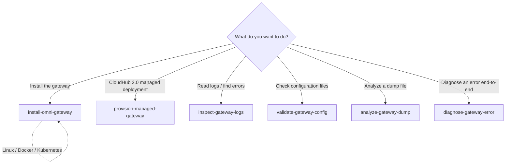

# Omni Gateway

## Overview

Omni Gateway (formerly Flex Gateway) is an Envoy-based API gateway that manages,
secures, and observes APIs and AI agents. It supports HTTP, WebSocket, gRPC,
GraphQL, MCP (Model Context Protocol), and Agent2Agent (A2A) communications. It
can be deployed as a MuleSoft-managed instance on CloudHub 2.0, or as a
self-managed instance on Linux, Docker, Kubernetes, or OpenShift.

## Available Skills

| Skill | When to use |
|-------|-------------|
| `install-omni-gateway` | Install and register on Linux, Docker, or Kubernetes (self-managed) |
| `provision-managed-gateway` | Provision a managed gateway on CloudHub 2.0 (v1.1, coming soon) |
| `inspect-gateway-logs` | Parse log output and surface errors and anomalies |
| `validate-gateway-config` | Check `conf.d/` YAML files for misconfigurations |
| `analyze-gateway-dump` | Interpret the contents of a diagnostic dump ZIP |
| `diagnose-gateway-error` | Triage any gateway error and get escalation guidance |

## Next Steps After Installation

Once the gateway is installed and registered:
1. Apply a policy to an API: see `secure-api`
2. Monitor and debug: see `inspect-gateway-logs`
