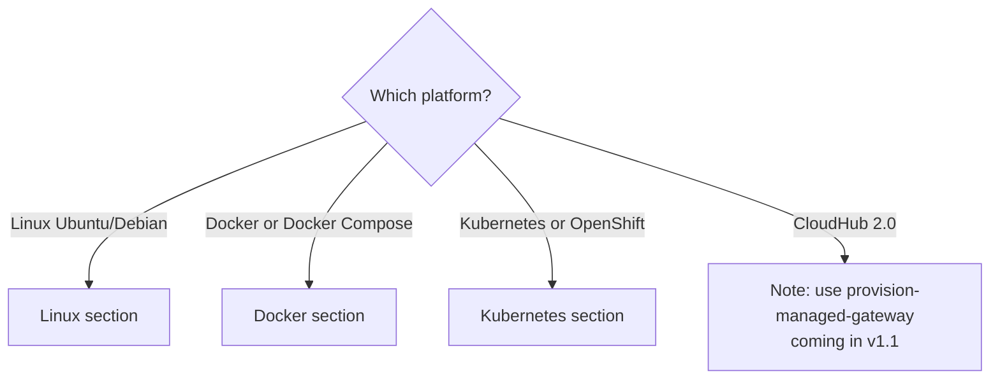

---

## name: install-omni-gateway
description: |
  Install MuleSoft Omni Gateway on self-managed infrastructure: Linux (Ubuntu/Debian via APT),
  Docker or Docker Compose, or Kubernetes / OpenShift (Helm). Use when the user
  wants to install or deploy Omni Gateway and needs platform-specific commands and
  configuration files to complete the setup. For CloudHub 2.0 managed deployments,
  use provision-managed-gateway instead.

# Install Omni Gateway

## Choose Your Platform




---

## Linux Installation (Ubuntu/Debian)

This section covers Ubuntu and Debian distributions only. For RHEL, CentOS, or Amazon Linux,
contact the gateway team for RPM repository details — do not attempt to use the APT repository
on RPM-based systems.

### Execution Paths

- **Connected mode** (Steps 1 → 2 → 3 → 4 → 5): Install the package, add the APT repo, install
flex-gateway, register with Anypoint, then start and verify.
- **Local mode** (Steps 1 → 2 → 3 → 5): Skip Step 4 (registration). The gateway runs
standalone without connecting to Anypoint Platform.

---

### Step 1 — Verify prerequisites

Check whether `flexctl` is already on the system. If it is, this may be an upgrade rather than
a fresh install — warn the user and confirm they want to continue.

```bash
which flexctl && flexctl version
```

Check the OS distribution to confirm Ubuntu or Debian:

```bash
cat /etc/os-release | grep -E "^(ID|ID_LIKE)="
```

If the output shows `rhel`, `centos`, `amzn`, or similar, stop here. The APT-based instructions
below do not apply. Ask the user to contact the MuleSoft gateway team for RPM repository details.

**What you'll need before continuing:**

- Ubuntu or Debian host (any LTS release)
- `sudo` access
- Internet connectivity to `flex-packages.anypoint.mulesoft.com`
- For connected mode: an Anypoint Platform organization ID and a connected app token (see `register-gateway`)

---

### Step 2 — Add the MuleSoft APT repository

Register the MuleSoft GPG signing key and add the package repository to the system's APT sources:

```bash
curl -XGET -L https://flex-packages.anypoint.mulesoft.com/ubuntu/pubkey.gpg | sudo apt-key add -
echo "deb https://flex-packages.anypoint.mulesoft.com/ubuntu $(lsb_release -cs) main" | sudo tee /etc/apt/sources.list.d/mulesoft.list
sudo apt update
```

The `$(lsb_release -cs)` substitution inserts your Ubuntu/Debian codename (e.g., `jammy`, `focal`,
`bookworm`) so the correct repository variant is selected automatically.

**Common issues:**

- `**lsb_release: command not found`**: Install it with `sudo apt install -y lsb-release`, then
rerun the `echo` command.
- `**apt-key` deprecation warning on Ubuntu 22.04+**: This is a warning only; the key is still
accepted. For a warning-free alternative, download the key to `/etc/apt/trusted.gpg.d/` using
`gpg --dearmor`.

---

### Step 3 — Install flex-gateway

```bash
sudo apt install -y flex-gateway
flexctl version
```

`flexctl` is the gateway management CLI bundled with the package. If `flexctl version` returns a
version string, the installation succeeded.

---

### Step 4 — Register with Anypoint Platform (connected mode only)

Skip this step if running in local mode.

Registration contacts Anypoint Platform, creates a gateway record in your organization, and writes
a `registration.yaml` file to `conf.d/`. This file is the gateway's identity credential — keep it
secure and do not commit it to source control.

```bash
sudo flexctl registration create <gateway-name> \
  --token=<token> \
  --organization=<orgID> \
  --connected=true \
  --anypoint-url=https://anypoint.mulesoft.com \
  --output-directory=/usr/local/share/mulesoft/flex-gateway/conf.d
```

Replace `<gateway-name>` with a descriptive name (e.g., `prod-linux-gw`), `<token>` with a
connected app bearer token, and `<orgID>` with your Anypoint organization ID.

For guidance on obtaining the token and organization ID, see the `register-gateway` skill.

**Common issues:**

- `**401 Unauthorized`**: The token is invalid, expired, or belongs to a different organization.
Regenerate the token in Anypoint Platform → Access Management → Connected Apps.
- `**Permission denied` writing to `conf.d/**`: The command must be run with `sudo` so it can
write to the system directory.

---

### Step 5 — Start and verify

Enable the systemd service so it starts on boot, then start it and check its status:

```bash
sudo systemctl enable flex-gateway
sudo systemctl start flex-gateway
sudo systemctl status flex-gateway
```

The status output should show `active (running)`. For connected mode, the gateway will appear in
Anypoint Runtime Manager within a few seconds of startup.

To tail the logs directly:

```bash
sudo journalctl -u flex-gateway -f
```

Look for a line containing `STARTED` to confirm the gateway is fully initialized.

---

## Docker Installation

### Execution Paths

- **Connected mode, docker run** (Steps 1 → 2 → 3 → 4 → 5): Prepare directories, pull the image,
register, run the container, and verify.
- **Local mode, docker run** (Steps 1 → 2 → 4 → 5): Skip Step 3 (registration). Start the
container without a registration YAML.
- **Docker Compose** (Steps 1 → 2 → 3-compose → 4 → 5): Use a Compose file instead of a bare
`docker run` command. Registration (Step 3) still applies for connected mode.

---

### Step 1 — Prepare the conf.d directory

Create a local directory that will be bind-mounted into the container as the gateway's
configuration store:

```bash
mkdir -p ~/flex-gateway/conf.d
ls -la ~/flex-gateway/
```

Verify the directory is writable by your user. The gateway process inside the container runs as
the UID you provide — mismatched permissions are one of the most common startup failures.

---

### Step 2 — Pull the gateway image

```bash
docker pull mulesoft/flex-gateway
```

This pulls the `latest` tag. For production deployments, pin to a specific version tag
(e.g., `mulesoft/flex-gateway:1.8.0`) to avoid unintended upgrades.

---

### Step 3 — Register with Anypoint Platform (connected mode only)

Skip this step if running in local mode.

Use the bundled `flexctl` binary inside the image to perform registration. The `-u $UID` flag
runs the registration process as your current user so the output file is owned by you:

```bash
docker run --entrypoint flexctl -u $UID \
  -v "$(pwd)":/registration mulesoft/flex-gateway \
  registration create \
  --organization=<orgID> \
  --token=<token> \
  --output-directory=/registration \
  --connected=true \
  --anypoint-url=https://anypoint.mulesoft.com \
  <gateway-name>
```

This writes `registration.yaml` (and related files) to your current working directory. Move the
registration YAML to `~/flex-gateway/conf.d/` before starting the gateway container:

```bash
mv registration.yaml ~/flex-gateway/conf.d/
```

---

### Step 3-compose — Docker Compose variant

Instead of a bare `docker run`, generate a `docker-compose.yml` in the project directory:

```yaml
version: "3.9"
services:
  flex-gateway:
    image: mulesoft/flex-gateway
    user: "${UID}"
    volumes:
      - ./conf.d:/usr/local/share/mulesoft/flex-gateway/conf.d
    ports:
      - "8081:8081"
    restart: unless-stopped
```

Place the registration YAML (Step 3, connected mode) in a `conf.d/` subdirectory alongside
`docker-compose.yml` before running `docker compose up`.

---

### Step 4 — Run the container

For a standalone `docker run`:

```bash
docker run -d \
  -v ~/flex-gateway/conf.d:/usr/local/share/mulesoft/flex-gateway/conf.d \
  -p 8081:8081 \
  --name flex-gateway \
  mulesoft/flex-gateway
```

For Docker Compose:

```bash
docker compose up -d
```

Adjust `-p 8081:8081` to match the port(s) your `ApiInstance` resources listen on. If you have
multiple APIs on different ports, add multiple `-p` flags (e.g., `-p 8081:8081 -p 9090:9090`).

---

### Step 5 — Verify

```bash
docker ps --filter name=flex-gateway
docker logs --tail=50 flex-gateway
```

`docker ps` should show the container in `Up` state. In the logs, look for a line containing
`STARTED` to confirm the gateway finished initializing. There is no external HTTP health endpoint
— gateway health is reported through log output and, in connected mode, via Anypoint Runtime
Manager status.

**Common issues:**

- **Container exits immediately**: Run `docker logs flex-gateway` to see the error. The most
common causes are a missing or malformed `registration.yaml`, a permissions mismatch on `conf.d/`,
or a port already in use.
- `**bind: address already in use`**: Another process is listening on the mapped port. Change
the host-side port (e.g., `-p 18081:8081`) or stop the conflicting process.

---

## Kubernetes Installation

### Execution Paths

- **Standard Kubernetes** (Steps 1 → 2 → 3 → 4 → 5): Gather prerequisites, add the Helm repo,
generate `values.yaml`, install via Helm, and verify.
- **OpenShift** (Steps 1 → 2 → 3-ocp → 4 → 5): Same flow, but add OpenShift-specific security
context settings to `values.yaml` in Step 3-ocp before running the Helm install.

---

### Step 1 — Gather prerequisites

Confirm the tooling is in place and the cluster context is correct:

```bash
helm version
kubectl cluster-info
```

Before proceeding, collect:

- **Namespace**: The recommended namespace is `gateway` (it will be created if it does not exist).
- **Registration YAML**: A `registration.yaml` file for connected mode (see `register-gateway`).
- **Image tag**: Defaults to `latest`; pin to a specific version for production.
- **Service type**: `ClusterIP` (internal only), `NodePort`, or `LoadBalancer` (external).

---

### Step 2 — Add the Flex Gateway Helm repository

```bash
helm repo add flex-gateway https://flex-packages.anypoint.mulesoft.com/helm
helm repo update
```

---

### Step 3 — Generate values.yaml

Create a `values.yaml` file that configures the Helm release:

```yaml
gateway:
  mode: connected      # Use "local" for local mode
replicaCount: 1
image:
  tag: latest
service:
  type: ClusterIP
```

For production deployments, set `replicaCount` to 2 or more for high availability, and pin
`image.tag` to a specific version.

---

### Step 3-ocp — OpenShift variant

If deploying on OpenShift, add the following to `values.yaml` before running the Helm install.
These settings satisfy OpenShift's default Security Context Constraints (SCCs):

```yaml
podSecurityContext:
  runAsNonRoot: true
serviceAccount:
  annotations:
    openshift.io/scc: nonroot
```

Merge these fields into the `values.yaml` from Step 3 above.

---

### Step 4 — Install via Helm

For connected mode (with a `registration.yaml` file in the current directory):

```bash
helm -n gateway upgrade -i --create-namespace ingress flex-gateway/flex-gateway \
  --set-file registration.content=registration.yaml \
  --set gateway.mode=connected
```

For local mode, omit `--set gateway.mode=connected` or explicitly set `--set gateway.mode=local`.
The `--create-namespace` flag creates the `gateway` namespace if it does not already exist.
The release name `ingress` is the conventional name for a gateway Helm release; change it if
your organization uses a different naming convention.

To apply your custom values file:

```bash
helm -n gateway upgrade -i --create-namespace ingress flex-gateway/flex-gateway \
  -f values.yaml \
  --set-file registration.content=registration.yaml
```

---

### Step 5 — Monitor and verify

Wait for the rollout to complete, then inspect pods and logs:

```bash
kubectl rollout status deployment/ingress -n gateway
kubectl get pods -n gateway
kubectl logs -n gateway deployment/ingress --tail=50
```

A successful rollout shows all pods in `Running` state. In the logs, look for a line containing
`STARTED` to confirm the gateway is fully initialized. For connected mode, the gateway will appear
in Anypoint Runtime Manager within a few seconds of startup.

**Common issues:**

- `**ImagePullBackOff`**: The node cannot reach the Docker Hub registry, or the image tag does
not exist. Check network egress rules and confirm the tag with `docker pull mulesoft/flex-gateway:<tag>`.
- `**CrashLoopBackOff**`: Run `kubectl logs -n gateway deployment/ingress` to inspect the
startup failure. Common causes: missing `registration.yaml` secret, malformed YAML in a
ConfigMap, or an OpenShift SCC violation.
- `**Pending` pods**: Check for resource quota or node affinity issues with
`kubectl describe pod -n gateway`.

---

## Next Steps After Installation

Once the gateway is installed and running:

1. **Register with Anypoint (connected mode)** — if registration was not completed during
  installation, or to verify the gateway appears in Runtime Manager: see `register-gateway`.
2. **Apply a policy to an API** — configure API proxying and security: see `secure-api`.
3. **Monitor logs** — parse and interpret gateway log output: see `inspect-gateway-logs`.
4. **Validate your conf.d configuration** — check YAML resource files for misconfigurations
  before deploying changes: see `validate-gateway-config`.

---

## Related Jobs

- `provision-managed-gateway` — CloudHub 2.0 managed deployment (v1.1, coming soon)
- `register-gateway` — Connect a self-managed gateway to Anypoint Platform
- `validate-gateway-config` — Validate conf.d YAML configuration
- `inspect-gateway-logs` — Parse and interpret gateway log output
- `diagnose-gateway-error` — End-to-end triage when the gateway returns errors

